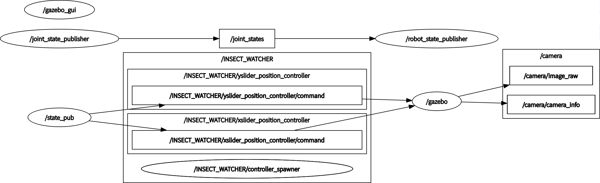

# 一、Gazebo 仿真

## 功能包依赖

```xml
<?xml version="1.0"?>
<package format="2">
  <name>iw_sim</name>
  <version>0.0.0</version>
  <description>The iw_sim package</description>
  <maintainer email="piggy@todo.todo">piggy</maintainer>
  <license>TODO</license>

  <!--   <doc_depend>doxygen</doc_depend> -->
  <buildtool_depend>catkin</buildtool_depend>
  <build_depend>controller_manager</build_depend>
  <build_depend>gazebo_plugins</build_depend>
  <build_depend>gazebo_ros</build_depend>
  <build_depend>gazebo_ros_control</build_depend>
  <build_depend>joint_state_controller</build_depend>
  <build_depend>robot_state_publisher</build_depend>
  <build_depend>roscpp</build_depend>
  <build_depend>rospy</build_depend>
  <build_depend>std_msgs</build_depend>
  <build_depend>urdf</build_depend>
  <build_depend>xacro</build_depend>
  <build_export_depend>controller_manager</build_export_depend>
  <build_export_depend>gazebo_plugins</build_export_depend>
  <build_export_depend>gazebo_ros</build_export_depend>
  <build_export_depend>gazebo_ros_control</build_export_depend>
  <build_export_depend>joint_state_controller</build_export_depend>
  <build_export_depend>robot_state_publisher</build_export_depend>
  <build_export_depend>roscpp</build_export_depend>
  <build_export_depend>rospy</build_export_depend>
  <build_export_depend>std_msgs</build_export_depend>
  <build_export_depend>urdf</build_export_depend>
  <build_export_depend>xacro</build_export_depend>
  <exec_depend>controller_manager</exec_depend>
  <exec_depend>gazebo_plugins</exec_depend>
  <exec_depend>gazebo_ros</exec_depend>
  <exec_depend>gazebo_ros_control</exec_depend>
  <exec_depend>joint_state_controller</exec_depend>
  <exec_depend>robot_state_publisher</exec_depend>
  <exec_depend>roscpp</exec_depend>
  <exec_depend>rospy</exec_depend>
  <exec_depend>std_msgs</exec_depend>
  <exec_depend>urdf</exec_depend>
  <exec_depend>xacro</exec_depend>

  <export>
  </export>
</package>

```


## 关于 xacro

### 模型的关节属性

移动关节必须设置 ==limit==

```xml
<joint
    name="xslider_joint"
    type="prismatic">
    <origin
      xyz="-0.123 -0.015 0.2549"
      rpy="0 0 0" />
    <parent
      link="base_link" />
    <child
      link="xlider_link" />
    <axis
      xyz="1 0 0" />
    <limit
      lower="0"
      upper="0.203"
      effort="30"
      velocity="0.2" />
</joint>
```

- axis 为移动的轴：
  - 当 xyz=“1 0 0” 时，关节移动方向为 x 轴正方向；
  - 当 xyz=“-1 0 0” 时，关节移动方向为 x 轴负方向。
- limit 为移动关节的限制，以关节初始位置为依据：
  - lower 代表位移下限，单位 m；
  - upper 代表位移上限；
  - effort 代表力上限，单位 N；
  - velocity 代表速度上限，单位 m/s。

### xacro 中的 gazebo 标签

#### 给每个关节添加驱动电机

```xml
<transmission name="trans_xslider"> <!--该名称随意定义就好-->
    <type>transmission_interface/SimpleTransmission</type>
    <joint name="xslider_joint"> <!--这里必须是模型中相应joint的名称-->
        <hardwareInterface>PositionJointInterface</hardwareInterface>
    </joint>
    <actuator name="xslider_motor"> <!--电机名称随意定义就好-->
        <hardwareInterface>PositionJointInterface</hardwareInterface>
        <mechanicalReduction>1</mechanicalReduction> <!--电机减速比-->
    </actuator>
</transmission>

<transmission name="trans_yslider"> <!--该名称随意定义就好-->
    <type>transmission_interface/SimpleTransmission</type>
    <joint name="yslider_joint"> <!--这里必须是模型中相应joint的名称-->
        <hardwareInterface>PositionJointInterface</hardwareInterface>
    </joint>
    <actuator name="yslider_motor"> <!--电机名称随意定义就好-->
        <hardwareInterface>PositionJointInterface</hardwareInterface>
        <mechanicalReduction>1</mechanicalReduction> <!--电机减速比-->
    </actuator>
</transmission>
```

hardwareInterface 是硬件接口，分别有：

- PositionJointInterface：位置接口，用于位置控制；
- VelocityJointInterface：速度接口，用于速度控制；
- EffortJointInterface：力接口，用于力控制。

#### 添加控制插件

```xml
<gazebo>
    <plugin name="gazebo_ros_control" filename="libgazebo_ros_control.so">
        <robotNamespace>/INSECT_WATCHER</robotNamespace> <!--自己给定机器人命名空间-->
    </plugin>
</gazebo>
```


## 控制配置文件

```yaml
#机器人命名空间必须和上面控制插件中的一致
INSECT_WATCHER:
    # 发布机器人关节状态信息
    joint_state_controller:
    	type: joint_state_controller/JointStateController
        publish: 50   #频率为50Hz

    xslider_position_controller:
    	#控制器类型必须和gazebo标签中的硬件接口相对应
        type: position_controllers/JointPositionController
        joint: xslider_joint
        pid: {p: 100.0, i: 0.01, d: 10.0}

    yslider_position_controller:
    	#控制器类型必须和gazebo标签中的硬件接口相对应
        type: position_controllers/JointPositionController
        joint: yslider_joint
        pid: {p: 100.0, i: 0.01, d: 10.0}
```


## launch 启动文件

```xml
<launch>
    <!--gazebo显示模型-->
    <include file="$(find gazebo_ros)/launch/empty_world.launch" />
    <param name="robot_description" 
           command="$(find xacro)/xacro $(find iw_sim)/xacro/iw_gazebo.xacro" />
    <node pkg="gazebo_ros" type="spawn_model" 
          name="model" args="-urdf -model Insect_Watcher -param robot_description" />
	
    <!--加载控制器-->
    <rosparam file="$(find iw_sim)/config/Insect_Watcher_control.yaml" command="load"/>
    <node name="controller_spawner" pkg="controller_manager" type="spawner" respawn="false"
    output="screen" ns="/INSECT_WATCHER" args="joint_state_controller
    xslider_position_controller yslider_position_controller"/>
    <node name="robot_state_publisher" pkg="robot_state_publisher" 
          type="robot_state_publisher" respawn="false" output="screen">
        <remap from="/jointstate" to="/INSECT_WATCHER/joint_state" />
    </node>
 
    <!--rviz显示-->
    <node name="joint_state_publisher" 
          pkg="joint_state_publisher" type="joint_state_publisher" />
    <node name="rviz" pkg="rviz" type="rviz" args="-d $(find iw_sim)/config/urdf.rviz" />

</launch>
```


## 编写节点向控制器发布数据

```python
import rospy
from std_msgs.msg import Float64    

if __name__ == '__main__':
    rospy.init_node('state_pub')
    
    #所要发布到的话题1：INSECT_WATCHER/xslider_position_controller/command
    pub1 = rospy.Publisher('INSECT_WATCHER/xslider_position_controller/command', Float64, queue_size=100)
    
    #所要发布到的话题1：INSECT_WATCHER/yslider_position_controller/command
    pub2 = rospy.Publisher('INSECT_WATCHER/yslider_position_controller/command', Float64, queue_size=100)
    
    msg1 = Float64()
    msg2 = Float64()
    v=Float64()
    v.data=0.05

    rate = rospy.Rate(0.5) # 0.5Hz
    init_rate = rospy.Rate(0.2)

    #初始化
    msg1.data=0.0515
    msg2.data=0.057
    pub1.publish(msg1)
    pub2.publish(msg2)
    init_rate.sleep()

    while not rospy.is_shutdown():
        msg1.data=0.0515
        msg2.data=0.057
        pub1.publish(msg1)
        pub2.publish(msg2)
        rate.sleep()
        msg2.data=0.107
        pub2.publish(msg2)
        rate.sleep()
        msg2.data=0.157
        pub2.publish(msg2)
        rate.sleep()
        msg1.data=0.1015
        pub1.publish(msg1)
        rate.sleep()
        msg2.data=0.107
        pub2.publish(msg2)
        rate.sleep()
        msg2.data=0.057
        pub2.publish(msg2)
        rate.sleep()
        msg1.data=0.1515
        pub1.publish(msg1)
        rate.sleep()
        msg2.data=0.107
        pub2.publish(msg2)
        rate.sleep()
        msg2.data=0.157
        pub2.publish(msg2)
        rate.sleep()
```

最后通过 rqt_graph 命令，可以看到



state_pub节点成功将控制数据发布到了话题：

- INSECT_WATCHER/xslider_position_controller/command 
- INSECT_WATCHER/yslider_position_controller/command 

> 椭圆框代表节点，方框代表话题。


